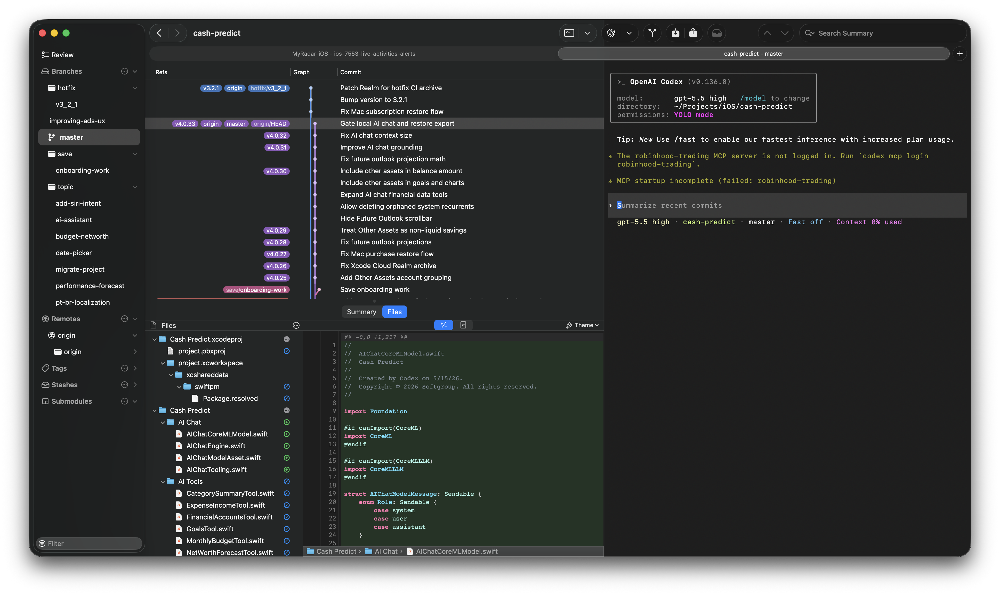

# Helm



Helm is a native macOS Git client built for AI-native developers who still want
Git to be the source of truth. It brings branch navigation, staging, history,
diff review, custom commands, and coding-agent terminals into one fast desktop
workflow.

The app is Git-first: AI tools can help inside the workflow, but repository
state, review, and commit decisions stay visible and under your control. Helm is
built with Swift, AppKit, SwiftUI, and libgit2, with a focus on native macOS
performance and a contributor-friendly codebase.

## Highlights

- Browse commit history with branch graph visualization.
- Search history by commit message, author, committer, or SHA.
- Inspect staged, unstaged, and committed file changes.
- Preview files as diffs, blame, plain text, or Quick Look content.
- Manage branches, remotes, tags, stashes, and submodules from the sidebar.
- Run common repository operations through native macOS dialogs.
- Launch coding agents from the embedded terminal with repository context.
- Define custom commands for repeatable project-specific workflows.
- Configure editor themes, diff settings, and custom repository actions.

## Project Status

Helm is under active development. Core browsing, staging, history, branch,
remote, stash, terminal-agent, custom-command, and preview workflows are
implemented, but the project is still evolving and should be treated as pre-1.0
software.

Contributions are welcome, especially fixes that improve reliability,
performance on large repositories, and polish in common Git workflows.

## Requirements

- macOS 26.0 or later
- Xcode 16 or later
- Swift 5
- Homebrew dependencies for libgit2 SSH support:
  - `libgit2`
  - `openssl@3` or `openssl`
  - `libssh2`
- Node.js only if you are changing the bundled CodeMirror web assets

## Getting Started

Clone the repository with submodules:

```bash
git clone --recursive git@github.com:kleber-maia/helm.git
cd helm
```

If you already cloned without submodules, initialize them:

```bash
git submodule update --init --recursive
```

Install native dependencies:

```bash
brew install libgit2 openssl@3 libssh2
```

Build the app:

```bash
xcodebuild -project Helm.xcodeproj -scheme Helm -configuration Debug build
```

You can also open `Helm.xcodeproj` in Xcode and run the `Helm` scheme. On
Apple Silicon, use the `My Mac` destination rather than Rosetta.

## Code Signing

For local development, either remove the app target's code signing identity in
Xcode or create:

```text
Xcode-config/DEVELOPMENT_TEAM.xcconfig
```

with:

```text
DEVELOPMENT_TEAM = <Your TeamID>
```

That file is intentionally ignored so each contributor can keep local signing
settings private.

## Web Assets

The diff, blame, and text preview panes use a bundled CodeMirror build. Only
rebuild it when changing files under `Helm/html-build/`:

```bash
cd Helm/html-build
npm install
npm run build
```

The generated bundle is written to `Helm/html/codemirror-bundle.js`.

## Architecture

Helm uses a three-layer architecture:

- UI layer: AppKit and SwiftUI window controllers, views, panels, and dialogs.
- Controller layer: repository coordination, task queues, caching, file
  watchers, and Combine publishers.
- Repository layer: Swift wrappers around libgit2 and protocol-oriented Git
  capabilities.

The repository protocols are split by capability, such as branching, staging,
stashing, remotes, workspace access, and file diffing. This keeps dependencies
explicit and makes the code easier to test with fake implementations.

For more detail, see [ARCHITECTURE.md](ARCHITECTURE.md).

## Contributing

Please read [CONTRIBUTING.md](CONTRIBUTING.md) before opening a pull request.

Useful local checks:

```bash
xcodebuild -project Helm.xcodeproj -scheme Helm -configuration Debug build
swiftlint lint Helm/
```

There is not a dedicated test target yet. The architecture is designed for one,
and new tests should prefer fake repository implementations over real
repositories where practical.

## License

Helm is available under the Apache License 2.0. See [COPYING](COPYING) for the
full license text.
